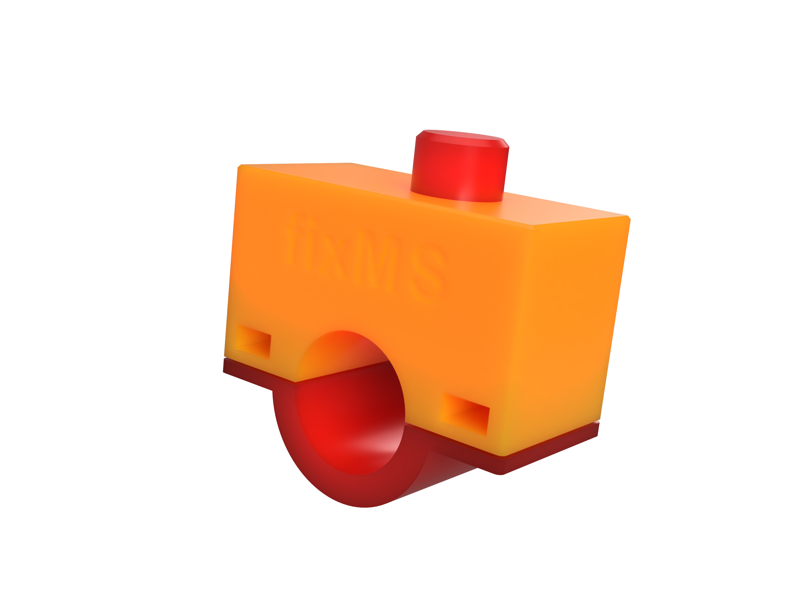

# README

This is a bike button subproject of [Münsterhack](https://muensterhack.de/) 2022 project "fixMS", which aims to provide nicer UI for the _flaw report form_ ([Mängelmeldung-Formular](https://www.stadt-muenster.de/maengelmeldung)) provided by the city of Münster.
This subproject aims for the power user.
It allows to quickly remember a position during a bike ride, which can be reported afterwards in calm surrounding.

## 3D rendering



## Parts list and required tools

This are the parts and tools we used for rapid prototyping.
But it is also possible to substitute it with other hardware.

- [Assembled Adafruit HUZZAH32 – ESP32 Feather Board - with Stacking Headers](https://www.adafruit.com/product/3619)
- [TC-MT250ART](https://www.conrad.de/de/p/tru-components-tc-mt250art-drucktaster-tastend-1-st-1589481.html)
- Some wires
- 3D printer (to print the case)
- soldering station

## Setup

- https://randomnerdtutorials.com/installing-the-esp32-board-in-arduino-ide-windows-instructions/
- Use the following Board: "ESP32 Dev Module"
- Create a ``wifi_credentials.h`` file with the following content and real credentials:

```c
const char* ssid = "...";
const char* password = "...";
```

The button is soldered to GND and pin 23.
If you want to use an other pin you have to adapt the code accordingly.

## Tech stack

- [Arduino 1.8.7](https://www.arduino.cc/en/software/OldSoftwareReleases)
- [Fusion 360](https://www.autodesk.de/products/fusion-360/personal)

## Useful links

- https://www.megunolink.com/articles/wireless/how-do-i-connect-to-a-wireless-network-with-the-esp32/
- https://www.teachmemicro.com/esp32-restful-api/
